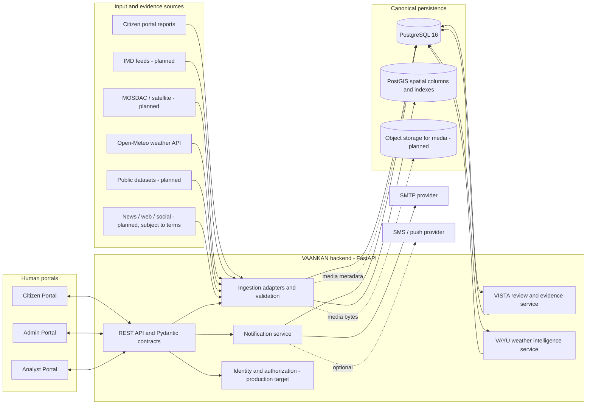
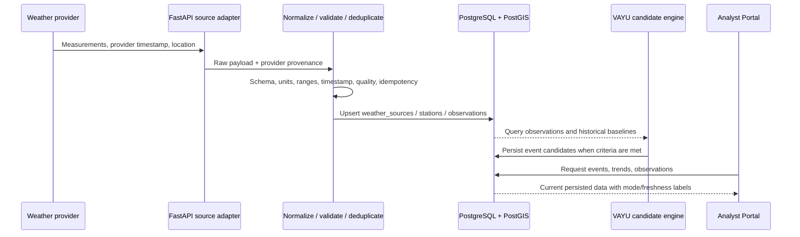
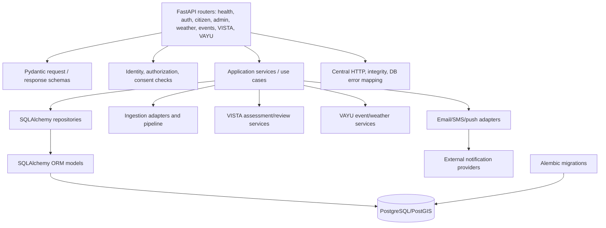
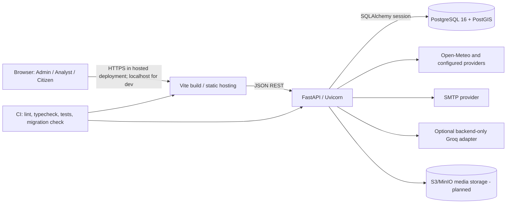

# VAANKAN System Architecture

**Purpose:** Hackathon-ready architecture specification for designing and presenting the VAANKAN weather intelligence platform. This document distinguishes the running implementation from proposed target capabilities; planned components are not represented as already operational.

**Architecture principle:** PostgreSQL/PostGIS is the canonical application database. The browser renders user interfaces and captures input; it is not the system of record. Weather observations, citizen reports, verification decisions, events, activities, and notification delivery outcomes flow through the backend and are persisted centrally.

## 1. Scope and Status

| Area | Current implementation | Hackathon target / future |
|---|---|---|
| Web portals | React 19, TypeScript, Vite; Admin, Analyst, Citizen routes | Shared design system, accessible responsive workflows |
| API | FastAPI REST endpoints with Pydantic contracts | Versioned API, OpenAPI contract tests, role-based authorization |
| Database | PostgreSQL 16 + PostGIS; SQLAlchemy ORM, Alembic migrations | Managed PostgreSQL/PostGIS with backups, retention, monitoring |
| Weather input | Open-Meteo current and historical services; deterministic event candidates | Add authorized IMD/MOSDAC/data.gov.in feeds and provider adapters |
| Citizen input | Auth and report endpoints; persisted report and activity schema | Secure uploads, consent, rate limits, duplicate and abuse controls |
| VISTA | Admin review and persisted decisions; deterministic/demo verification contract | Evidence fusion, explainable calibrated models, reviewer feedback loop |
| VAYU | Deterministic weather candidate logic and verified-ground-observation pipeline | Persistent event evolution, calibrated risk models, analyst evaluation |
| Email | SMTP sender configured; test message can be dispatched; verification records recipient outcomes | Retryable delivery queue, bounce handling, per-user preferences |
| SMS / push | Provider adapter/configuration path; delivery is not assured without credentials | Twilio/FCM/Web Push with opt-in, retry, rate limits, audit |
| Admin identity | Demo login only; database browser uses a backend key | Production identity provider, MFA, RBAC, server-enforced permissions |
| Streaming | Browser refresh and API polling | Server-sent events/WebSocket for status and alert updates |
| Object storage | No production media store yet | S3-compatible object store (e.g. MinIO/S3) plus DB metadata |

## 1.1 Technology Stack

The versions below reflect the repository's package manifests at the time this architecture was written. Lockfiles and deployment images should be treated as the final source of exact resolved versions.

| Layer | Current prototype stack | Responsibility | Planned / optional evolution |
|---|---|---|---|
| Web runtime | React 19.2, React DOM 19.2 | Component-based Citizen, Admin, and Analyst portals | Keep a single web application until independently scaling portals is justified |
| Language and build | TypeScript 6, Vite 8, Node.js/npm | Type-checking, development server, frontend bundling and production build | CI build artifacts and static hosting/CDN |
| UI and interaction | Lucide React icons; project CSS; React hooks | Portal controls, responsive layouts, state and client-side API orchestration | Shared tested design-system components and accessibility checks |
| Maps | Leaflet 1.9, React Leaflet 5, OpenStreetMap tiles | Report/event map rendering and location context | Tile/provider service with production usage policy; optional vector tiles for scale |
| API framework | Python 3.12+ (validated in the workspace on Python 3.13), FastAPI 0.115 | REST routes, dependency injection, OpenAPI docs, async weather endpoints | Versioned `/api/v1` contracts, gateway/rate limits and server-enforced identity |
| API contracts | Pydantic 2.11 | Request validation, response schemas, enums and field constraints | Contract/version compatibility tests and generated client types |
| ASGI server | Uvicorn 0.34 | Local/prototype FastAPI process | Managed container runtime/process manager with health probes |
| HTTP/provider clients | HTTPX 0.28 and standard-library SMTP | Weather-provider calls and outbound email | Provider-specific adapters, timeouts, bounded retries, circuit breakers and async workers |
| Persistence ORM | SQLAlchemy 2.0 | ORM mapping, sessions, transaction boundaries and query construction | Pool sizing, read replicas and query tuning driven by measurements |
| Geospatial ORM | GeoAlchemy2 0.17 | Geometry/geography columns and spatial query integration | Continue PostGIS-compatible SQL and spatial query plans |
| Database | PostgreSQL 16 | Relational source of truth for identity, reports, verification, events, notifications and audit | Managed PostgreSQL with HA, backups, point-in-time recovery and monitoring |
| Geospatial database | PostGIS 3.4 in local Compose image | WGS84 spatial columns, GiST indexes, distance/radius and event correlation | Partitioning/tiling only when data volume and measured query load require it |
| Schema migrations | Alembic 1.15 | Versioned, reviewable PostgreSQL schema evolution | Migration checks in CI; forward-only production change policy |
| Local infrastructure | Docker Compose and `postgis/postgis:16-3.4` | Reproducible local PostGIS and separate test database | OCI containers and managed cloud services for deployed environments |
| Weather data | Open-Meteo current and historical endpoints; local deterministic weather-intelligence service | Retrieve weather-model observations, historical context and deterministic event candidates | Authorized IMD/MOSDAC/public adapters; do not imply they are connected until implemented and tested |
| Ingestion contracts | Python adapter protocol, Pydantic normalized records, deterministic preview pipeline | Source metadata, normalization, validation, dedupe demonstration and routing | Scheduled jobs/queue workers and persistent ingestion receipt/error tables |
| VISTA methods | Pydantic/schema checks, deterministic quality/dedupe path, persisted human Admin decision | Reviewability, evidence capture, decision status and audit | TF-IDF/logistic baseline; optionally evaluate multilingual transformer or media triage after labeled data exists |
| VAYU methods | Deterministic/statistical candidate rules, PostGIS spatial queries, weather observations and verified ground observations | Candidate event generation and evidence-linked analysis | Robust seasonal anomaly baselines, calibrated tree-based models, temporal validation and model registry |
| Email | SMTP via Python `smtplib`/`EmailMessage`, backend environment configuration | Welcome/test/verified-alert email handoff and status reporting | Durable outbox/worker, retry/backoff, bounce/complaint and delivery telemetry |
| SMS / push | Adapter/configuration hooks; provider delivery depends on credentials | Optional channels; not assumed operational | Twilio SMS, Web Push or FCM with consent, preferences, retries and audit |
| Optional LLM | Backend-only Groq service configuration exists | Optional assisted explanation path; not the verification authority | Grounded summaries with evidence references, redaction, safety evaluation and usage limits |
| Object/media storage | No production object store yet; report may contain a media reference | Prototype stores report metadata; not a secure media pipeline | S3-compatible object storage (e.g. MinIO/S3), signed URLs, scanning, checksums and retention |
| Test/tooling | Pytest 8.3, FastAPI TestClient, TypeScript compiler, ESLint 10 | API lifecycle, persistence and frontend build/lint checks | PostgreSQL integration tests in isolated `postgis-test` database, load/security/accessibility testing |
| Observability | Health/readiness routes and application/provider status responses | Prototype diagnostics | Structured logs, traces, metrics, dashboards, alerting and request correlation |

### Technology selection rationale

- **React + TypeScript + Vite** provides a fast, strongly typed browser prototype and keeps the three role experiences in one deliverable.
- **FastAPI + Pydantic** provides explicit request contracts, validation errors, generated OpenAPI documentation and a lightweight Python path to weather/data-science libraries.
- **PostgreSQL + PostGIS** provides transactional records, relational audit/evidence links, JSONB provenance and spatial filtering in one durable database appropriate for the prototype and regional pilot.
- **SQLAlchemy + Alembic** separate database queries from API handlers and make schema evolution repeatable.
- **Leaflet + OpenStreetMap** supplies an interactive prototype map without embedding a proprietary map SDK. Production tile use must follow provider policy and expected traffic.
- **Open-Meteo** gives the prototype a usable weather observation source. Its data mode and provenance must remain visible; it is not a substitute for authorized official warning feeds.
- **Docker Compose** makes the database reproducible locally. It is not the production orchestration or high-availability plan.

### Deliberately not in the current stack

Kafka, Spark, Flink, Hadoop, Redis, Kubernetes, a feature store, a trained transformer/vision model, and a production object store are **not installed or required for the current prototype**. They are potential future options only when scale, latency, data governance, and operational capacity justify them. The hackathon-scale implementation should first prove correctness, source provenance, review workflow, PostGIS queries, and reliable database persistence.

## 2. System Context



**Trust boundaries:** external/citizen input is untrusted; the backend validates and records provenance. A citizen assertion is not an official meteorological observation. An Admin decision is a human adjudication with an audit record, not an official government warning. Weather-provider values retain provider name, timestamp, units, freshness, and quality metadata.

## 3. End-to-End Data Flows

### 3.1 Weather-source ingestion



1. Each provider has an adapter implementing the ingestion-source contract; provider-specific formats do not leak into portal code.
2. Normalize coordinates to WGS84 (EPSG:4326), timestamps to UTC, and measurements to canonical units while retaining original units and provider provenance.
3. Validate required fields and physical bounds; classify missing, stale, suspect, estimated, and provider-reported values explicitly.
4. Build a stable source record ID/content hash and use idempotent upserts to make retries safe.
5. Persist raw payloads or source references according to storage/retention policy. The operational tables contain normalized values and provenance.
6. VAYU reads persisted measurements; candidate generation can be recomputed. Do not imply that current Open-Meteo data is universal ground truth or an official warning.

### 3.2 Citizen report to verification to analysis

```mermaid
sequenceDiagram
    actor Citizen
    participant CP as Citizen Portal
    participant API as FastAPI
    participant DB as PostgreSQL/PostGIS
    participant Vista as VISTA / Admin review
    participant Mail as SMTP
    participant Vayu as VAYU
    participant Analyst as Analyst Portal

    Citizen->>CP: Submit description, event, time, location, evidence
    CP->>API: POST /api/reports
    API->>API: Validate request, normalize, assign/validate citizen identity
    API->>DB: Insert reports + provenance + media metadata
    API->>DB: Insert citizen_activities: REPORT_SUBMITTED
    DB-->>CP: record_id and PENDING status
    Vista->>API: Load review queue and evidence
    actor Admin
    Admin->>Vista: Verify / request review / mark suspicious
    Vista->>API: POST /api/admin/reports/{id}/submit-verification
    API->>DB: Update report + verification_results + evidence + admin_actions + audit_logs
    alt Status is VERIFIED
        API->>DB: Upsert ground_observations; correlate VAYU event
        API->>DB: Find opted-in profiles within 10 km
        API->>Mail: Send email to eligible recipients
        Mail-->>API: Provider result per recipient
        API->>DB: Insert notifications and citizen_activities
    else Not verified
        API->>DB: Persist decision; do not dispatch verified-alert email
    end
    Analyst->>API: GET persisted events / observations / reports
    API->>DB: Read canonical records
    DB-->>Analyst: Verified data and provenance
```

**Decision semantics:** `PENDING` stays in review; `VERIFIED` creates or refreshes a verified ground observation and permits downstream VAYU analysis; `SUSPICIOUS` and `UNSUPPORTED` remain review outcomes and must not be counted as verified ground observations. VAYU consumes verified records from the database; there is no separate manual “submit to VAYU” action in the intended flow.

**Email semantics:** only an administrator-committed `VERIFIED` decision triggers nearby-alert email. Eligibility requires a registered profile with a valid saved location, consent/preferences, and distance within the configured radius (currently 10 km). SMTP `configured` means credentials exist; only a provider response of `sent` means the SMTP handoff succeeded. Persist recipient, channel, status, error code/message (redacted), and timestamp. Do not claim the recipient read or received the email in their inbox.

## 4. Portal Responsibilities

### Citizen Portal

- Register and authenticate against backend identity APIs; passwords are never stored in browser storage.
- Capture a weather report with description, claimed event type, event time, coordinates/locality, impact, severity, and optional media reference.
- Persist the report to PostgreSQL and show a server-backed report history by citizen identity.
- Show local reports/verified alerts using PostGIS-backed nearby APIs, with explicit empty, loading, stale, and unavailable states.
- Save GPS only after browser permission and user consent; no default or fabricated coordinates.
- Dedicated Activities view reads `citizen_activities`, including report submission, acknowledgement, verification/alert activity.
- Clearly distinguish citizen claims from official weather measurements and verified reports.

### Admin Portal

- Operations dashboard, report review queue, report detail/evidence, source status, submission/audit history, and protected database records dashboard.
- Submit a decision with operator, reason, prior/new status, and server timestamp.
- Show persisted server result; never mark a report verified or send duplicate alerts solely in client state when the API fails.
- History comes from audit records and retains display metadata if the report is later removed.
- Database browser is a maintenance interface, not the main operational review workflow. Destructive access must be separately authorized and audited. Keep PostGIS/system metadata read-only.
- Production requirement: replace demo login with server-side RBAC; UI hiding is not authorization.

### Analyst Portal

- Read-only views of persisted reports, verified observations, weather measurements, candidate events, provenance, data quality, and event timelines.
- Filters: time window, event type, region/district, source, quality/freshness, verification state.
- Show uncertainty and data mode; do not present an unassessed severity as calibrated risk.
- No admin verification or record mutation. Analysis exports should include the selected filters and source/update metadata.

## 5. Backend Structure



### Code ownership map

| Component | Current location | Responsibility |
|---|---|---|
| FastAPI app/routes | `backend/main.py` | REST endpoints, request orchestration, status codes, transaction boundary |
| Request/response contracts | `backend/schemas.py`, `backend/ingestion/schemas.py` | Pydantic validation, enums, bounds, API compatibility |
| ORM schema | `backend/models.py` | SQLAlchemy entities, keys, indexes, relations, PostGIS columns |
| Connection/session | `backend/database.py` | `DATABASE_URL`, engine/session lifecycle, explicit memory/Postgres mode |
| Repositories | `backend/repositories.py` | SQL queries, spatial distance, CRUD/upsert, audit persistence |
| Use-case service | `backend/services.py` | Persistence orchestration, verification, ground observations, correlations, history |
| Source adapters | `backend/sources/`, `backend/ingestion/` | Provider clients, normalization, source metadata, quality and deduplication |
| Weather/event engine | `backend/sources/weather_intelligence.py` | Current weather aggregation and deterministic event-candidate rules |
| Notification adapters | `backend/email_service.py`, `backend/notifications.py` | SMTP/SMS configuration and provider handoff |
| Schema evolution | `backend/migrations/versions/` | Additive, versioned Alembic migrations; never hand-edit production schema |
| Frontend API clients | `src/services/` | Typed fetch clients; no database credentials or direct SQL from browser |

**Transaction rule:** one business action (report creation; admin verification plus audit/evidence/ground observation/notification attempt) is committed in a defined unit. Provider network calls should ultimately move to an outbox/worker so slow or failed SMTP cannot leave partially applied database state.

## 6. Database Design

### Technology and conventions

- PostgreSQL 16 is the durable source of truth; PostGIS supplies geometry/geography and spatial indexes.
- Coordinates are WGS84 / EPSG:4326. Use `geography` for meter-based radius and distance calculations; consistently store geometry points as longitude then latitude.
- Primary internal keys are UUIDs; externally visible `record_id`, `event_id`, and `observation_id` are stable unique identifiers.
- Event/report timestamps use timezone-aware UTC. Convert only for display.
- JSONB is appropriate for provenance/provider metadata and model/evidence details that vary by source; query-critical fields remain typed columns.
- All schema changes use Alembic revisions. Enforce foreign keys, uniqueness, indexes, and retention constraints in PostgreSQL, not in the frontend.

### Entity catalogue

| Table | Purpose / important relationships |
|---|---|
| `users` | Citizen/admin/analyst identity; unique email, password hash, active state, timestamps. Production passwords should use Argon2id/bcrypt rather than the current demo hash. |
| `roles`, `user_roles` | Many-to-many authorization roles; target roles include `citizen`, `admin`, `analyst`, and service identity. |
| `citizen_profiles` | Phone, government-ID reference, address, optional coordinates/location, GPS consent; one-to-one user. Avoid storing raw government IDs unless necessary; prefer tokenized/encrypted identifier and strict access. |
| `reports` | Canonical citizen/external report; record ID, source, timestamp, text, event type, coordinates, locality, verification status, content hash, provenance. Owner is currently carried in provenance; target should be a typed FK to users. |
| `media` | Media metadata, object-store key, MIME type, size, checksums/perceptual hash; media bytes belong in object storage, not PostgreSQL. |
| `verification_results` | Each VISTA/admin run: engine/version, status, score where calibrated, processed time, structured metadata; FK to report/model version. |
| `verification_evidence` | Explainable evidence items: rule/model/source, score, explanation, metadata; FK to verification result. |
| `ground_observations` | Admin-verified observation derived from a report; unique report relationship, location/time/type, verification method/confidence; downstream VAYU input. |
| `weather_sources` | Provider registry and health/configuration status; credentials are references to secret manager, never stored here. |
| `weather_stations` | Provider/station identity, location, region, status. |
| `weather_observations` | Normalized provider measurements, timestamp, station/source, quality, anomalies, provenance and units. Unique provider observation key should be added for robust idempotent upsert. |
| `weather_events` | Persisted VAYU event aggregate/candidate: spatial centre/geometry, type, start/update/end, status, evidence summaries, counts, provenance. Severity/confidence remain nullable/unassessed until calibrated. |
| `event_reports` | Many-to-many event/report evidence relation and relation type (verified, corroborating, etc.). |
| `event_clusters` | Spatial/temporal grouping membership or cluster algorithm and parameters. |
| `event_timeline` | Append-only event lifecycle changes and analyst-readable evolution. |
| `alerts` | Alert definition, event linkage, status and audience radius; separate an analytical event from a dispatched citizen alert. |
| `notifications` | One attempted channel delivery per recipient; provider status, error, sent timestamp and optional message ID. Never store email credentials here. |
| `citizen_activities` | Durable citizen-facing activity stream: report submitted, alert received/acknowledged, admin verification result. |
| `model_versions` | VISTA/VAYU engine name, version, training/data lineage, artifact URI and lifecycle status. |
| `model_metrics` | Versioned evaluation metrics, dataset, date and metric value. |
| `prediction_logs` | Auditable inference input reference, output, version and processing time; avoid duplicated personal data. |
| `admin_actions` | Structured human decision history linked to report and admin identity. |
| `audit_logs` | Append-only cross-domain audit entry: actor, action, entity, occurred time, request ID, safe details. |

### Key constraints and indexes

- Unique: user email, government-ID token if required, report `record_id`, source-scoped report hash, station/source identity, observation/source key, event ID, and one ground-observation per verified report where business rules permit.
- Foreign keys: cascade child evidence/media/event links when a report is intentionally deleted; restrict deletion of identities/audit history by default.
- Spatial GiST indexes on citizen profile location, reports, weather stations, weather events, and ground observations.
- B-tree indexes on report status/time/source/type/region, observation source/time/station/quality, notification status/time, audit entity/time, and activity citizen/time.
- Retention: operational reports and decisions should be retained according to policy; raw provider payloads, logs, and media may have shorter configurable retention. Database reset is a development operation, not a production workflow.

### Database ER model

```mermaid
erDiagram
    USERS ||--o| CITIZEN_PROFILES : has
    USERS }o--o{ ROLES : assigned
    USERS ||--o{ ADMIN_ACTIONS : performs
    USERS ||--o{ AUDIT_LOGS : acts
    USERS ||--o{ NOTIFICATIONS : receives
    USERS ||--o{ CITIZEN_ACTIVITIES : owns
    REPORTS ||--o{ MEDIA : includes
    REPORTS ||--o{ VERIFICATION_RESULTS : assessed_by
    VERIFICATION_RESULTS ||--o{ VERIFICATION_EVIDENCE : explains
    MODEL_VERSIONS ||--o{ VERIFICATION_RESULTS : versions
    MODEL_VERSIONS ||--o{ MODEL_METRICS : evaluated_by
    MODEL_VERSIONS ||--o{ PREDICTION_LOGS : emits
    REPORTS ||--o| GROUND_OBSERVATIONS : may_become
    REPORTS ||--o{ ADMIN_ACTIONS : reviewed_in
    WEATHER_SOURCES ||--o{ WEATHER_STATIONS : provides
    WEATHER_SOURCES ||--o{ WEATHER_OBSERVATIONS : provides
    WEATHER_STATIONS ||--o{ WEATHER_OBSERVATIONS : measures
    WEATHER_EVENTS ||--o{ EVENT_REPORTS : includes
    REPORTS ||--o{ EVENT_REPORTS : supports
    WEATHER_EVENTS ||--o{ EVENT_CLUSTERS : grouped_as
    WEATHER_EVENTS ||--o{ EVENT_TIMELINE : evolves
    WEATHER_EVENTS ||--o{ ALERTS : may_trigger
    ALERTS ||--o{ NOTIFICATIONS : dispatches
    REPORTS ||--o{ CITIZEN_ACTIVITIES : creates
```



## 7. VISTA: Verification and Evidence Assessment

**Goal:** prioritize and explain the reliability of incoming claims. VISTA is not an official warning authority and must not label a citizen report as meteorological truth without independent corroboration.

### VISTA pipeline

1. **Input acceptance:** citizen text/location/time/media reference or external source item.
2. **Normalization:** canonical event taxonomy, UTC timestamp, WGS84 coordinates, language metadata, source identity.
3. **Quality checks:** required fields, impossible coordinates, stale timestamps, missing location, invalid media metadata, duplicate hash, suspicious rate patterns.
4. **Evidence retrieval:** nearby weather observations, verified ground observations, provider alerts, temporal/spatial corroboration, provenance.
5. **Assessment:** deterministic rules now; future models emit calibrated scores and feature evidence, not a bare label.
6. **Human review:** Admin accepts, requests review, marks suspicious, or marks unsupported, with reason and operator identity.
7. **Persistence:** append verification result/evidence/action/audit; update current report state transactionally.
8. **Downstream gate:** only `VERIFIED` may create/update a verified ground observation for VAYU. Pending/suspicious/unsupported remain visible with their correct status.

### Models and methods

**Implemented today:** request/schema validation, source-aware deterministic demo ingestion, duplicate handling in preview, deterministic/rule-based VISTA contract, and human admin decisions. There is no trained production VISTA classifier in the portal workflow today.

**Hackathon model plan:**

- Establish a transparent rules baseline first: location plausibility, time consistency, exact/perceptual duplicate signal, source trust class, nearby observation agreement, and media availability.
- For text classification, compare TF-IDF + Logistic Regression as an interpretable baseline against a compact multilingual transformer only if labeled data and compute are available.
- For image reuse/tamper triage, use perceptual hashes and metadata consistency first; a vision classifier requires curated, consented labels and robust evaluation.
- Do not use an LLM as a fact verifier. A backend-hosted LLM may summarize already-persisted evidence for the reviewer, with citations to evidence IDs; it must not change verification status automatically.
- Store model name/version, input evidence references, scores, thresholds, explanation/features, and evaluation set in `model_versions`, `verification_results`, `verification_evidence`, and `prediction_logs`.
- Measure precision/recall by event class, calibration, false-positive rate, subgroup performance, and drift. Human review is required before operational verification.

## 8. VAYU: Weather Intelligence and Event Analysis

**Goal:** identify and describe spatially/temporally supported weather patterns using persisted observations and verified ground reports. VAYU learns from/querys the shared database; do not create a second manual VAYU submission workflow.

### Current capability

- Open-Meteo current/historical data adapters provide weather-model observations and baseline context.
- Deterministic candidate criteria use weather signals, regions, and persistence; outputs are explicitly labeled by data mode.
- PostgreSQL persistence stores weather sources, stations, observations, verified ground observations, weather events and event/report relations.
- VAYU API exposes candidate/events, observations, ground observations, analytics and timelines; a portion of the older Admin Analysis UI remains legacy and should be migrated to these APIs before it is presented as live.
- Severity, confidence, and calibrated impact are unassessed unless a validated model and supporting evidence establish them.

### Target analysis stages

1. **Feature preparation:** hourly/daily rainfall windows, temperature anomaly, wind gust, visibility, pressure, quality/freshness, historical baseline and nearby verified report density.
2. **Anomaly baseline:** robust seasonal/region baseline (median/MAD or quantile thresholds) before more complex ML; record baseline window and source.
3. **Candidate detection:** deterministic multi-signal thresholds, spatial proximity, persistence and minimum data-quality requirements.
4. **Spatial-temporal correlation:** PostGIS `ST_DWithin`/geography for configurable radii; cluster by event type, time window, geography and provider evidence. Citizen reports are supporting evidence only after VISTA verification.
5. **Event state:** detected → corroborating → active → weakening/resolved, with append-only `event_timeline` and idempotent recomputation.
6. **Impact/severity:** initially rules with explicit unassessed/low/moderate/high levels only after thresholds are validated against historical outcomes and expert review.
7. **Analyst explanation:** show input observation IDs, sources, data freshness/quality, thresholds, model version and uncertainties.

### Future model candidates (not current production claims)

- Anomaly detection: seasonal quantile/robust z-score baseline; compare Isolation Forest only when enough representative data exists.
- Event classification/severity: gradient-boosted trees (e.g. XGBoost/LightGBM) on tabular meteorological features if labeled historical events are available; calibration via held-out time/region splits.
- Spatial/temporal clustering: PostGIS distance and deterministic time windows initially; evaluate DBSCAN/HDBSCAN only with measured cluster quality and stable operating parameters.
- Forecasting: evaluate a time-series baseline before deep networks; never extrapolate unsupported data into an “official warning.”
- Every candidate must beat the interpretable baseline on time-separated evaluation, preserve reproducibility, and record model/data versions.

## 9. Input Sources and Trust Classes

| Source class | Examples | Initial trust treatment | Target handling |
|---|---|---|---|
| Citizen observations | Citizen form: event, text, location, time, impact, optional media | Untrusted claim; `PENDING` until review | Consent, account linkage, rate limit, spam/duplicate checks, secure media storage |
| Meteorological model/provider | Open-Meteo current/historical API | Provider data, not universal ground truth | Persist station/source, run time, valid time, units, freshness, quality, provenance |
| Official meteorological feeds | IMD observations/warnings; only through authorized access | Source trust depends on feed/product and license | Distinguish official warning from VAANKAN analysis; keep source version and original ID |
| Satellite/remote sensing | MOSDAC/INSAT or authorized satellite products | Product-specific quality/latency | Store product/time/footprint and reproducible derived features |
| Public datasets | Government open datasets and historical archives | Dataset-specific, often delayed | License, attribution, date range and schema version stored |
| News/web/social | Authorized APIs/RSS/public sources; subject to policy and terms | Untrusted third-party report | Source terms, minimization, dedupe, abuse filtering, never imply complete coverage |
| Admin verified ground data | Human-verified citizen reports | Human-adjudicated evidence, not official meteorological station data | Persist reviewer, evidence, reason and time; feed VAYU via database |

Every ingestion receipt should record `source_id`, `source_type`, `source_record_id`, `ingested_at`, `observed_at`, `schema_version`, payload checksum, normalization status, quality flags, dedupe outcome, and processing error (redacted of secrets/PII as needed).

## 10. API and Service Boundaries

### REST endpoint families (current and target)

- `/health`, `/api/system/health`: liveness and DB/PostGIS readiness; no secrets in output.
- `/api/auth/citizen/*`, `/api/citizen/profile`: citizen identity/profile and consent (production target requires signed JWT/session and authorization).
- `/api/reports`, `/api/citizen/reports`: create/list/detail, citizen-scoped history, filters and pagination.
- `/api/admin/reports/*`, `/api/admin/submission-history`, `/api/admin/audit-logs`: review decisions, reasoned actions, persisted history.
- `/api/admin/database/*`: protected operational browser; use a separate strong secret now, but replace with RBAC/admin session before deployment.
- `/api/weather/*`, `/api/sources/*`: provider observations and source status.
- `/api/events/*`, `/api/vayu/*`: candidates, verified ground observations, persisted events, analytics.
- `/api/citizen/activities`, `/api/citizen/alerts/*`: durable citizen activities and acknowledgements.
- `/api/notifications/*`: mail test/dispatch and safe provider status; persist every recipient attempt.
- `/api/ingestion/*`: adapters, preview/receipts now; future background ingestion jobs.

**API rules:** Pydantic validates requests, stable IDs are returned, pagination is bounded, errors use actionable HTTP status/details, request IDs are logged, authorization scopes every citizen record, and DB writes are server-side only. Never send database URLs, SMTP/Groq/Twilio secrets or raw secret-bearing config to the browser.

## 11. Notifications and Reliability

### Current flow

- SMTP configuration is backend-only. A configured status confirms settings are present; an SMTP test verifies provider handoff.
- On a verified decision, find persisted, consented citizens within 10 km using PostGIS, send email, persist each result to `notifications`, and add citizen `VERIFIED_ALERT` activities.
- Do not report success for local UI state, empty recipient set, or `not_configured`/`failed` provider response.

### Hackathon-to-production hardening

1. In the same verification transaction, write a notification outbox event after decision commit.
2. Worker claims pending outbox rows with retry count/backoff and idempotency key `(event_id, user_id, channel)`.
3. Store delivery attempts/status, provider message ID, safe error category, retry time, and final state.
4. Provide preference/consent, unsubscribe, quiet hours, rate limiting, duplicate suppression, and bounce/complaint handling.
5. Add optional SMS/push adapters behind the same interface; never assume SMS/FCM is configured.
6. For hackathon scale, a PostgreSQL outbox table + background worker is sufficient; Kafka/Redis is an optional later scale-out, not a prerequisite.

## 12. Security, Privacy, and Governance

- Replace demo Admin/Analyst authentication with OIDC/JWT or secure server sessions, short-lived tokens, RBAC, MFA for privileged roles, CSRF protection if cookie sessions are used, and login throttling.
- Citizen reports/profile endpoints must derive user identity from a verified token, not trust a caller-supplied email or `citizen_id` query parameter. Current demo identity passing is not production-safe.
- Enforce ownership checks for read/update/delete, admin-only verification, analyst read-only access, and least-privilege DB credentials.
- Store password hashes with Argon2id/bcrypt and progressive rehash. Never store passwords or access tokens in localStorage/sessionStorage.
- Government ID is highly sensitive: avoid retaining raw values; if required, encrypt/tokenize, restrict access, define retention, and exclude it from generic dashboard exports/logs.
- Ask explicit consent for GPS and notification channels. Persist consent timestamp/purpose; support revoke/delete requests subject to audit/legal retention.
- Minimize precise-location access. Apply retention, field-level access and aggregation for analyst views.
- Use TLS for browser/API, managed secrets or environment injection for secrets, no committed `.env`, no secret logging.
- Validate upload type/size, scan media, store outside web root, use signed short-lived media URLs, and verify checksums.
- Audit privileged changes and database maintenance actions; protect append-only audit trail from generic deletion.
- Establish source terms, attribution, privacy assessment, incident response and human review policy before production.

## 13. Deployment and Operations

### Hackathon deployment



- Local: Vite `:5173`, FastAPI `127.0.0.1:8001`, PostGIS compose service `:5432`; use separate test DB/port for integration tests.
- Environment: `STORAGE_BACKEND`, `DATABASE_URL`, SMTP/provider settings, optional backend-only model API settings. Use secret manager in hosted deployment.
- Migrations run once as a deployment step; app startup should fail readiness when configured PostgreSQL is unreachable rather than silently writing to memory.
- Readiness checks include PostgreSQL and PostGIS. Liveness should remain cheap.
- Structured logs: request ID, route, latency, outcome, source ID, model version; redact citizen PII and credentials.
- Monitor provider freshness/error rate, ingestion lag, DB pool use, PostGIS query latency, queue backlog, notification delivery/failure, and report review age.
- Backups: scheduled full + WAL/PITR where supported; routinely test restore into isolated environment. Do not use the dashboard as a backup mechanism.

## 14. Hackathon Delivery Plan

### Must work for the demo

1. One PostgreSQL/PostGIS instance and Alembic-controlled schema.
2. Citizen registration/login/profile/GPS persists to DB; no fake location defaults.
3. Citizen report is stored with owner and provenance; history is scoped to that identity.
4. Admin queue loads only DB reports; decision transaction persists report status, evidence, action, audit and verified observation.
5. Verified report feeds VAYU from the DB automatically; no second submit button.
6. Email attempt is sent only for verified events to opted-in DB profiles within configured radius; result shown and persisted.
7. Analyst shows DB reports, weather observations and persisted event candidates; empty/unavailable states are truthful.
8. Activities page is fed by `citizen_activities`, with report/acknowledgement/verified-alert events.
9. Seed/reset is an explicit development command, never an automatic production startup side effect.

### Next increments

1. Make citizen/admin/analyst authentication server-enforced and fix ID-based ownership checks.
2. Finish migrating legacy Admin Analysis VAYU metrics, stations, events and reports from mock service to FastAPI/PostgreSQL.
3. Implement real IMD/MOSDAC/public adapters only where access and usage rights are established; persist ingestion receipts.
4. Add media object storage and secure upload pipeline.
5. Add Postgres notification outbox worker, retries, delivery preferences, and optional SMS/push.
6. Build labeled, versioned VISTA/VAYU model evaluation pipeline; retain human decision gates and model cards.
7. Add event timeline evolution, streaming updates, operational dashboards, DB backup/restore drills.
8. Performance/security validation: tenant authorization, load tests, spatial indexes/query plans, abuse controls, privacy review.

## 15. Hackathon Diagram Legend and Presentation Notes

- **Solid arrows:** implemented request/data path.
- **Dashed arrows or boxes marked planned:** future capability, not yet connected.
- **Citizen report:** untrusted observation until reviewed.
- **Weather observation:** provider/model measurement with source and freshness, not universal ground truth.
- **VISTA result:** evidence-backed triage/review state.
- **Admin verification:** explicit human governance gate.
- **Ground observation:** persisted verified report representation consumed by VAYU.
- **VAYU event:** deterministic/statistical event candidate with traceable evidence and uncertainty.
- **Alert:** citizen-facing delivery decision, separate from event candidate and provider warning.

For a hackathon presentation, walk the audience through one report ID from citizen submission, to `PENDING`, to Admin evidence review, to a verified ground observation, to a VAYU event query, to an audited SMTP delivery attempt. Show the same IDs in Admin History, Citizen Activities, and the database browser. Call out which signals are live provider data, which are user reports, and which future models are not yet trained.
